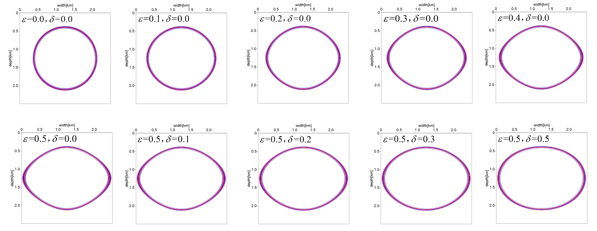
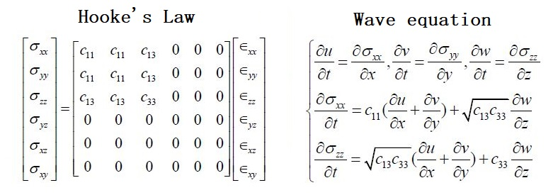

# 基于GPU NVIDIA CUDA 的 地震波 VTI 介质有限差分正演模拟

Copyright (C) RongTao, All right reserve.

[Rong Tao](https://github.com/Rtoax)

- 👋 Hi, I’m [@rtoax](https://github.com/Rtoax), you can see me in [@linux-visor](https://github.com/linux-visor) too.
- 👀 I’m interested in [Linux](https://github.com/torvalds/linux)
- 🌱 I’m currently learning [Linux](https://github.com/torvalds/linux)
- 💞️ I’m looking to collaborate on [libcareplus](https://github.com/Rtoax/libcareplus), [test-linux](https://github.com/Rtoax/test-linux) and [more](https://github.com/Rtoax).
- 📫 How to reach me [GitHub](https://github.com/Rtoax), [CSDN](https://rtoax.blog.csdn.net/), [Gitee](https://gitee.com/rtoax) and 哆啦Linux梦.


# 详情

This is a 2D and 3D VTI seismic finite difference forward modeling software based on NVIDIA GPU acceleration.
这是一个基于NVIDIA GPU加速运算的二维、三维VTI介质地震有限差分正演模拟软件。

Anyone can use the software for learning. 
任何人都可以免费使用该软件用于学习交流

The main interface of the software is shown in the figure below
软件主界面如下图所示。


You can get the result.
你可以得到的结果.



Wave equation as follows:



## dependence & envrioment 依赖以及编译环境

* Linux
* gcc
* cuda7.5+
* gtk+-2.0 || gtk+-3.0

## You can get the whole software from ```ALL.zip``` 

## Compiled and Run

```shell
$ make
$./binaryname
```
